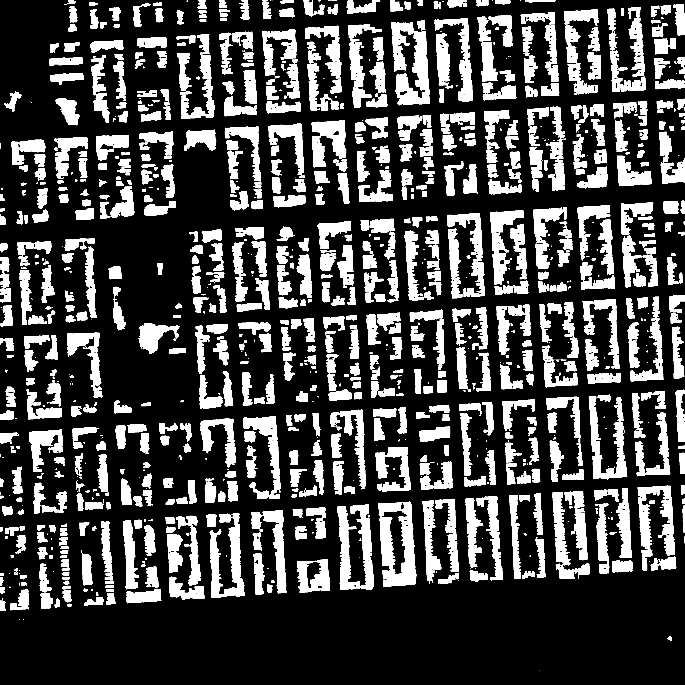
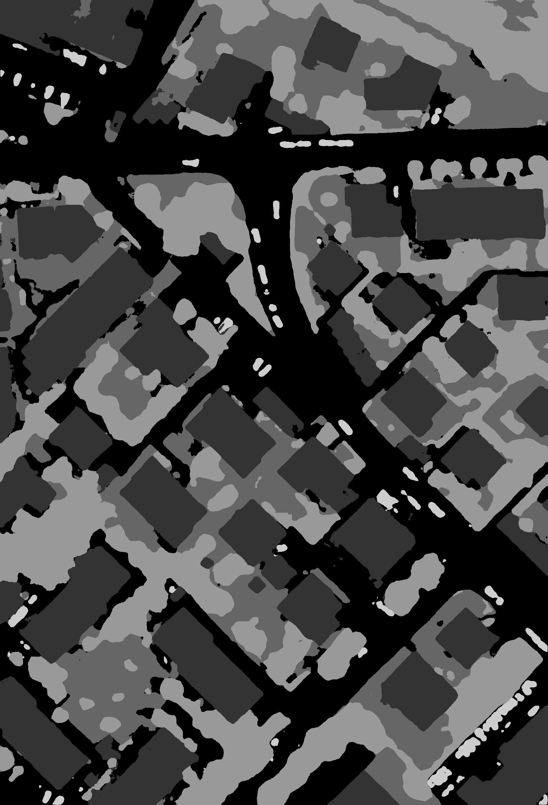

# Semantic segmentation of remotely sensing images
The repository contains the codes addressing the semantic segmentation over remotely sensing images on two publicly available aerial images:

1. [Inria Aerial Image Labeling Dataset [1]](https://project.inria.fr/aerialimagelabeling/)
2. [ISPRS Vaihingen Dataset [2]](http://www2.isprs.org/commissions/comm3/wg4/2d-sem-label-vaihingen.html)

To be able to train and test the proposed network, first training, validation and test samples should be extracted from these datasets. Then the extracted samples must be stored in [HDF5](https://en.wikipedia.org/wiki/Hierarchical_Data_Format) file to enable fast data access during training. The instruction required to generate the samples are provided in the following section:
- [Generating training, validation and test samples](#1-generating-training,-validation-and-test-samples)

Next, after the HDF5 files are prepared, we can proceed to train the proposed network using instructions provided at the following section:
- [Training the network](#2-training-the-network)

At the end, when the training course has been completed, the trained network can be deployed over test areas using the instruction in this following section:
- [Testing the network](#3-testing-the-trained-network)

# Prerequesties
- Computer with Linux
- [MATLAB](https://www.mathworks.com/)
- [PyTorch](https://pytorch.org/)
- NVIDIA GPU is highly recommended to speed up the training.

# 1. Generating training, validation and test samples

The samples required for training, validation or testing the network should be generated and stored in [HDF5](https://en.wikipedia.org/wiki/Hierarchical_Data_Format) file enabling fast reading during training.
The codes used to generate the dataset files are written in MATLAB and provided each dataset.


## 1.1 Training and validation samples (INRIA datset)
Training and validation samples are generated over five cities of Austin, Chicago, Kitsap County, Western Tyrol
and Vienna using the MATLAB [code](https://github.com/sinaghassemi/semanticSegmentation/blob/master/generatingSmples/GeneratingDataset_INRIA.m).

Each city includes 36 images sized 5000×5000 which covers a surface of 1500 m × 1500 m at the 30 cm resolution.
Based on what dataset providers recommended, we use the first five images of each city for extracting validation samples and the other images for training samples.

In the configuration section, there are arguments that should be set to extracted training, validation and test samples.  

```matlab
%% CONFIGURATIONS %%%%%%%%%%%%%%%%%%%%%%%%%%%%%%%%%%%%%%
path = '/AerialImageDataset/train/';     % Path to the data 
set  = 'train';                          % set flag can be set to 'val' | 'train' | 'test' to generate the corresponding samples

% train and val = {'austin','chicago','kitsap','tyrol-w','vienna'}
% test          = {'bellingham','bloomington','innsbruck','sfo','tyrol-e'}

city = 'bellingham';                % can be selected from the list above
hdf5Filename = strcat(city,'.h5');  % The h5 file in which samples will be stored         
datatype_patch = 'uint8';           % The data format 
datatype_label = 'uint8';           % The data format 
%%%%%%%%%%%%%%%%%%%%%%%%%%%%%%%%%%%%%%%%%%%%%%%%%%%%%%%%
```
For each city use for training, first train and then validation samples are extracted.
In the first run ```set  = 'train'```, training samples are generated in each city.
Then in the second run ```set  = 'val'```  validation samples are extracted from the same city.
These samples are then stored in a '.h5' file named after the city.

After training and validation samples are extracted from each of the five cities and in five separate files,
These files are combined together and stored in a single file using a MATLAB [code](https://github.com/sinaghassemi/semanticSegmentation/blob/master/generatingSmples/combiningCitiesToADataset_inria.m).


## 1.2 Test samples (INRIA datset)

To generate the test samples enabling the evaluation of network performance, there are two choices: 1. using the validation images. 2. using the test images.
Since the annotation of test images are not provided we can use validation images as test set to be able measure network performance. However, by using test images, and after the network output uploaded to the website, the corresponding analysis are given within few weeks by dataset providers.

To generate test samples from validation images, 'set' should be set to 'test' ```set  = 'test'```, city can be chosen from the first set that provided with annotation ```city = 'austin' %{'austin','chicago','kitsap','tyrol-w','vienna'}```, and in the section "Configurations for each set" and the test configurations, ```areas=[1,2,3,4,5]``` and ```withAnnotation = 1```.

To generate test samples from test images, 'set' should be set to 'test' ```set  = 'test'```, city can be chosen from the second set which are not provided with annotation ```city = 'bellingham' %{'bellingham','bloomington','innsbruck','sfo','tyrol-e'}```, and in the section "Configurations for each set" and the test configurations, ```areas=[1,2,...,36]``` and ```withAnnotation = 0```.


## 1.3 Training and validation samples (ISPRS Vaihingen)
For this dataset, the city of Vaihingen is selected to extracted training, validation and also test samples.
The city is divided into two sets, one is provided with annotations and used to extract training and validation samples while the second set are not provided with annotation and used to generate test samples.

Using a MTALAB [code](https://github.com/sinaghassemi/semanticSegmentation/blob/master/generatingSmples/GeneratingDataset_ISPRS.m)
, the first lines define the configurations:

```matlab
%% CONFIGURATIONS %%%%%%%%%%%%%%%%%%%%%%%%%%%%%%%%%%%%%%
folderPath ='/ISPRS_semantic_labeling_Vaihingen';	% Path to the data 
set = 'train'; 						                        %  set flag can be set to 'val' | 'train' | 'test' to generate the corresponding samples
hdf5Filename ='vaihingen.h5';				              % The h5 file in which samples will be stored  
DataFormat = 'uint8'; 
%%%%%%%%%%%%%%%%%%%%%%%%%%%%%%%%%%%%%%%%%%%%%%%%%%%%%%%%
```
First traning samples are extracted ```set = 'train'``` and the validation samples are generated ```set = 'val'```.


## 1.4 Test samples (ISPRS Vaihingen)

The same as INRIA dataset, since a set of images are not provided with annotations and reserved as test set, and they can be extracted by setting the flag ```set = 'test'```. The network output then should be sent to dataset organizer for further assessments.

However, also it is possible to extracted test samples from validation areas.
After setting the flag ```set = 'test'```, in the "Configurations for each set" section and in the test part, ``` area = [11,15,28,30,34] ``` defines the test areas to be the same as validation areas, then the flag ```  withAnnotation = 1 ``` indicates the this set should be extracted with annotation. Therefore we can measure the network performance using the provided annotations and over validation images.


# 2. Training the network

After preparing '.h5' files for each dataset, we can proceed to train the network using a python [file](https://github.com/sinaghassemi/semanticSegmentation/blob/master/cnn/main.py).

The file takes several arguments which defines network architecture, the dataset, training and optimization hyperparameters and so on which we describe some of these in the following:
```python
parser = argparse.ArgumentParser(description='PyTorch Satellite Segmentation')
parser.add_argument('--seed'		, default= 1		, type=int	, metavar='N', help='Torch and NumPy pseudorandom number generators seed (-1 disables manual seeding)')
parser.add_argument('--fileNameData'	, default=None		, type=str	, metavar='N', help='hdf5 file of the dataset, images file')
parser.add_argument('--preload'		, default='true'	, type=str	, metavar='N', help='set to true to preload entire dataset into memory')
parser.add_argument('--experiment'	, default='ex500'	, type=str	, metavar='N', help='Experiment Identifier')
parser.add_argument('--batchSize'	, default=8		, type=int	, metavar='N', help='batch size')
parser.add_argument('--imageSize'	, default=364		, type=int	, metavar='N', help='imageSize')
parser.add_argument('--patchSize'	, default=256		, type=int	, metavar='N', help='imageSize')
parser.add_argument('--nEpochs'		, default=300		, type=int	, metavar='N', help='total number of Epoches')
parser.add_argument('--nChannelsIn'	, default=4		, type=int	, metavar='N', help='number of input Channels')
parser.add_argument('--nChannelsOut'	, default=2		, type=int	, metavar='N', help='number of output Channels')
parser.add_argument('--nThreads'	, default=1		, type=int	, metavar='N', help='number of threads for data loading')
parser.add_argument('--depth'		, default=34		, type=int	, metavar='N', help='number of layers in encoder')
parser.add_argument('--optim'		, default='SGD'		, type=str	, metavar='N', help='optimizer [SGD | adagrad]')
parser.add_argument('--lr'		, default=1		, type=float	, metavar='N', help='learning rate strategy (SGD, >=1) or base value (Adagrad, any value)')
parser.add_argument('--lrDecay'		, default=1		, type=float	, metavar='N', help='learning rate decay (Adagrad)')
parser.add_argument('--weightDecay'	, default=1		, type=float	, metavar='N', help='weight rate decay (Adagrad)')
parser.add_argument('--GPU'		, default=True		, type=bool	, metavar='N', help='training over GPU')
parser.add_argument('--criterion'	, default='BCE'		, type=str	, metavar='N',choices=['2dNLL', 'BCE', 'MSE'], help='criterion')
parser.add_argument('--finetuneModule'	, default=None		, type=str	, metavar='N', help='network needed to be fine-tunned')
parser.add_argument('--testModule'	, default=None		, type=str	, metavar='N', help='running a testmodule over test areas')
parser.add_argument('--set'	  	, default='train'	, type=str	, metavar='N', choices=['train', 'val', 'test']	,help='set')
parser.add_argument('--dataset'	  	, default='isprs'	, type=str	, metavar='N', choices=['isprs','inria']	,help='dataset')
parser.add_argument('--crf'	 	, default=False  	, type=bool	, metavar='N', help='conditional random field')
parser.add_argument('--finetunedBN'	, default=False  	, type=bool	, metavar='N', help='fine tunning BN parameters  over test area')
parser.add_argument('--resetBN'		, default=False  	, type=bool	, metavar='N', help='reseting BN')
parser.add_argument('--BNFinetuningEpochs', default=1		, type=int	, metavar='N', help='BNFinetuningEpochs')
```
Total number of epochs are defined by ```nEpochs```, and the ```dataset``` can be chosen from ```['isprs','inria']```.
Other arguments such as ```nChannelsIn, nChannelsOut, imageSize, patchSize ``` depends on the patch extraction settings and the dataset itself.
``` lr, lrDecay, weightDecay, batchSize, optim``` indicates the training and optimization process.
```depht``` can be selected from a the list of ```[18,34,50,101,152,200]```.
```set``` by default is set to ```'train'``` and also can be set to ```'val'``` and ```'test'```.

For examples using the following commands in terminal:

```bash
python main.py --fileNameData inria.h5 --experiment 1 --depth 50 --imageSize 360 --patchSize 256 --nChannelsIn 3 --nChannelsOut 2 --dataset inria
```
to train the network with 50 layers over INRIA dataset.

Or running the following in terminal

```bash
python main.py --fileNameData vaihingen.h5 --experiment 2 --depth 50 --imageSize 364 --patchSize 256 --nChannelsIn 4 --nChannelsOut 6 --dataset isprs
```
to train the network over Vihingen city.

# 3. Testing the trained network

After training has been completed, it can be evaluated over validation images or test images.

For instance, running the following 
```bash
python main.py --experiment 1 --depth 50  --nChannelsIn 3 --nChannelsOut 2 --dataset inria --testModule ex1_bestNet_valF1.pt --set val  --batchSize 4
```
Evalute the trained network of ```ex1_bestNet_valF1.pt``` over validation set of INRIA dataset.

Or:

```bash
python main.py --experiment 2 --depth 50  --nChannelsIn 4 --nChannelsOut 6 --dataset isprs --testModule ex2_bestNet_valF1.pt --set val --batchSize 4
```
Evaluate the trained network of ```ex2_bestNet_valF1.pt``` over validation set of Vaihingen city.


To test the network and generate the outputs over testset and for INRIA and Vaihingen datasets:
```
python main.py --experiment 1 --depth 50  --nChannelsIn 3 --nChannelsOut 2 --dataset inria --testModule ex1_bestNet_valF1.pt --set test --batchSize 4
```
```
python main.py --experiment 2 --depth 50  --nChannelsIn 4 --nChannelsOut 6 --dataset isprs --testModule ex2_bestNet_valF1.pt --set test  --batchSize 4
```


## Some Examples
The predicted segmentation map over an image of INRIA testset:




The predicted segmentation map over an image of Vaihingen testset:
 



# References

[[1] Maggiori, Emmanuel, et al. "Can semantic labeling methods generalize to any city? the inria aerial image labeling benchmark." IEEE International Symposium on Geoscience and Remote Sensing (IGARSS). 2017.](https://hal.inria.fr/hal-01468452/document)

[[2] Cramer, Michael. "The DGPF-test on digital airborne camera evaluation–overview and test design." Photogrammetrie-Fernerkundung-Geoinformation 2010.2 (2010): 73-82.](https://www.ingentaconnect.com/content/schweiz/pfg/2010/00002010/00000002/art00003)


